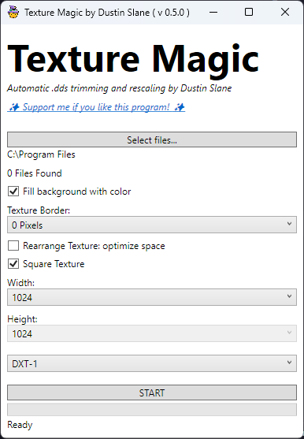

# Texture Magic

Texture magic is a handy tool to quickly crop and trim textures, scale and compress them to optimized defaults for FiveM and GTAV.

## Features
 - ✂️ Automatic cropping and trimming of DDS textures
 - ⚙️ Works on YTD files and DDS files so you don't have to extract the files first!
 - 📐 Automatic rescaling
 - 📐 Supports 1x1 textures and 1x2 textures
 - 🎨 DXT-1 and DXT-5 support
 - 🚀 Multithreaded! Will work on 4 textures at the same time speeding up conversions!

## Screenshots

 
## System Requirements:

✅ Windows 10 or Windows 11, 64 bit operating system required.\
❌ Windows 8.1, Windows 7, Linux/Mac or 32-bit not supported.

.NET 6.0 is required. You may already have this installed. If you don't, you can get it here:\
 [https://dotnet.microsoft.com/en-us/download/dotnet/6.0](https://dotnet.microsoft.com/en-us/download/dotnet/6.0)

## Download

[Find the latest release here](https://github.com/dustinslane/texture_magic/releases/latest). Download the ZIP file and extract where convenient. Run the program.

## Support me
If you like this program

## Usage

This list will go through the steps, and down the list of things on the screen.

1. Open the application
2. Click SELECT FILES. Select the files you want to convert.
   - You MUST only select textures that have the same UV-mapping at a time.
   - Example: only textures for `jbib_023.ydd`
3. Decide if you want a background color. It is gray. `#1F2020`.
4. Decide if you want a border around your texture. Select one from the dropdown.
5. (EXPERIMENTAL) You can have the program attempt to rearrange your texture in a more optimized arrangement. This probably won't work but it might?
6. Decide if the texture is square. Some textures (shoes) won't be.
7. Set the width you want.
8. If not square, set the height here.
9. IMPORTANT: select DXT-1 for textures without transparency. Select DXT-5 for textures with transparency.
10. Click start!

## Credits
### Libraries
- [Magick.NET](https://github.com/dlemstra/Magick.NET)
- [CodeWalker](https://github.com/dexyfex/CodeWalker)
### Application Icon 
- [Magic icons created by Freepik - Flaticon](https://www.flaticon.com/free-icons/magic)
- [Duck icons created by Merchadew - Flaticon](https://www.flaticon.com/free-icons/duck")